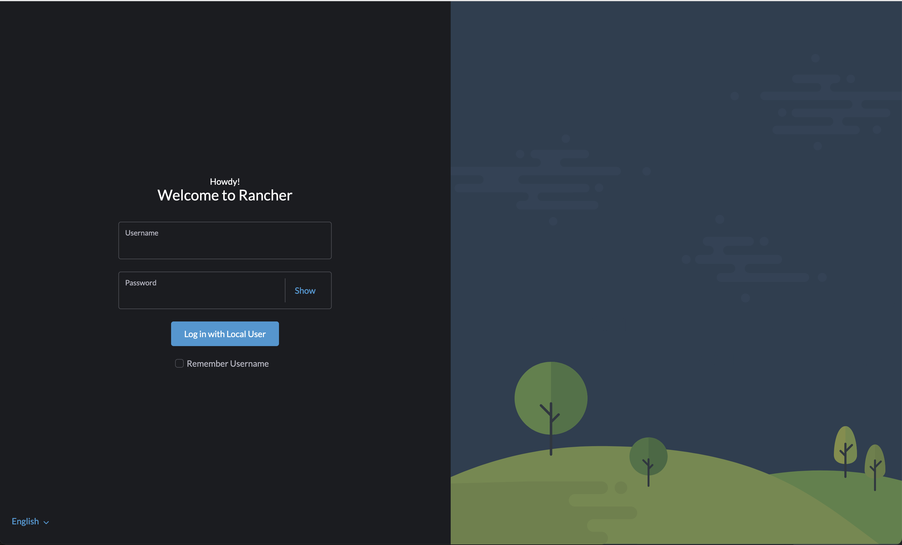
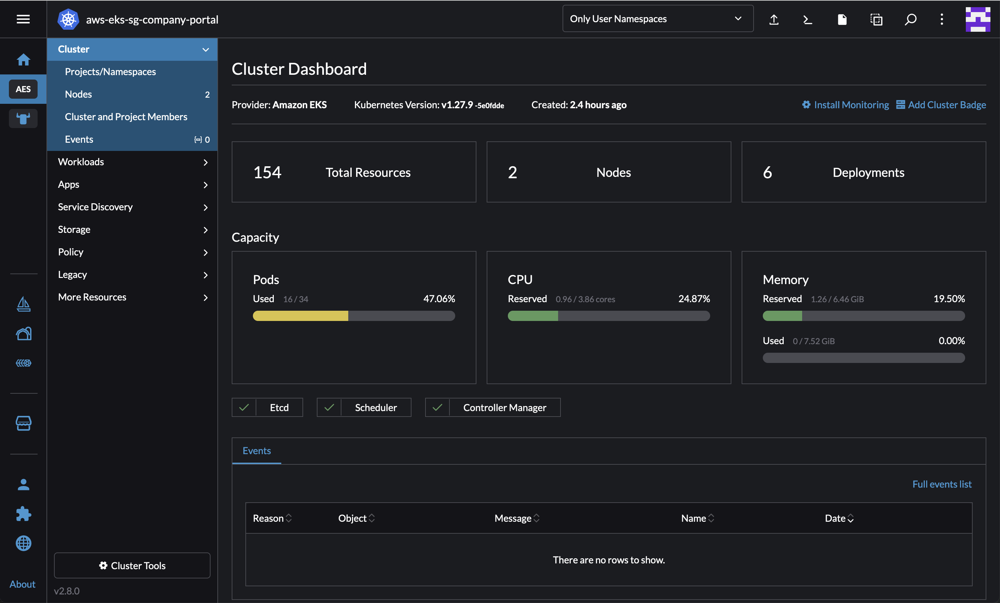
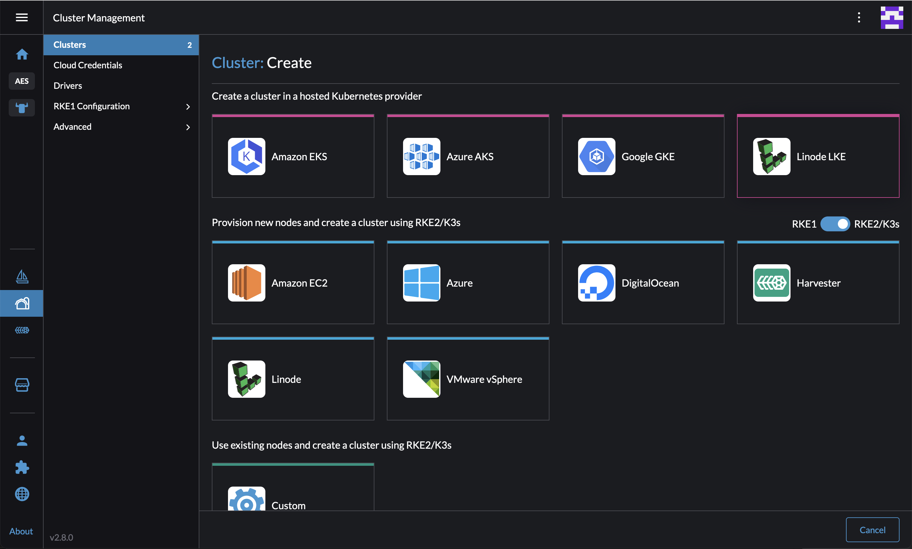
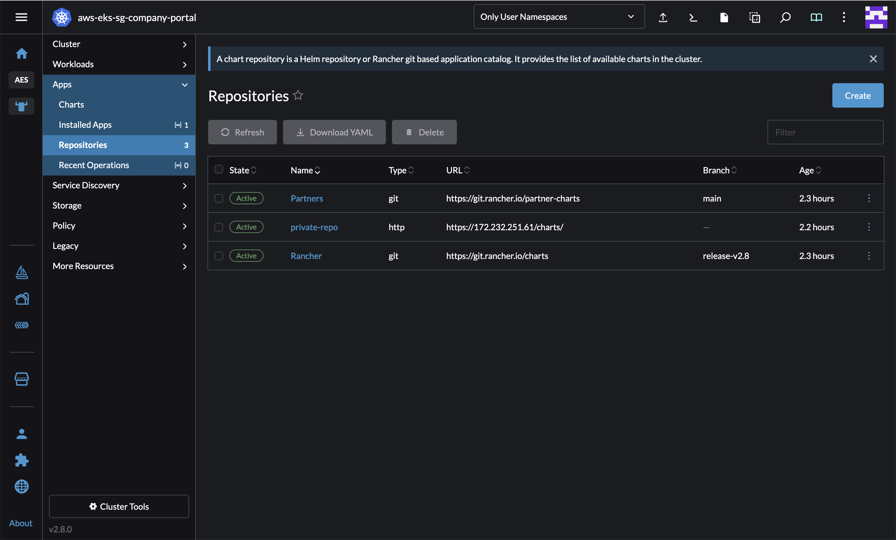
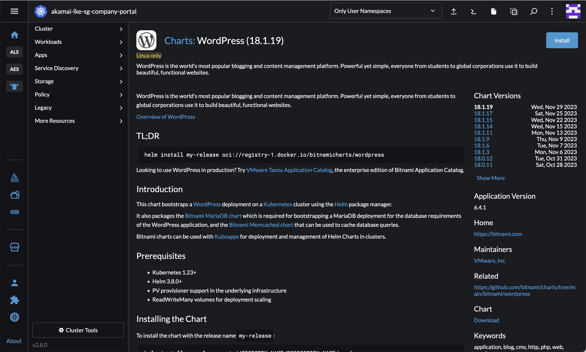
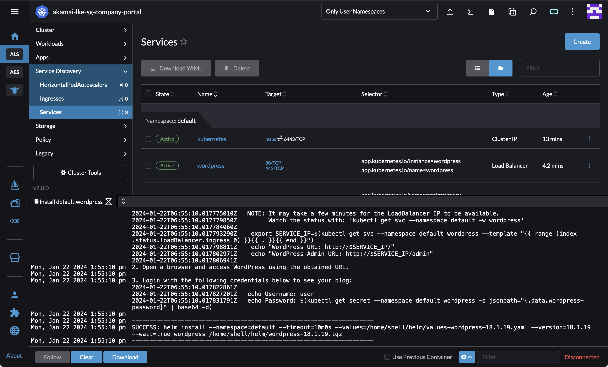

# Akamai University Compute Demo 

This repository is a demonstration highlighting Rancher's capabilities in orchestrating multi-cloud and multi-Kubernetes cluster deployments. Rancher simplifies cloud-native app deployment, containerization, security, networking, and Infrastructure-as-Code integration. The integration of Rancher with the Akamai/Linode cloud platform underscores Akamai's dedication to open standards and workload portability across various cloud environments. This demo is a GUI walkthrough.

## Features

### 1. **Cloud-Native Application Deployment:**
   - Deploy a sample cloud-native application (this demo uses WordPress) using Linode's integrated API with Rancher 

### 2. **Developer-Friendly GUI:**
   - Showcase a seamless developer and cloud engineering experience for multi-cloud environment
   - Extensive APIs for integration with popular multi-cloud management tools

### 3 **Multi-Cloud Multi-Cluster App Management:**
   - Simplify multi-cloud multi-cluster management with consistent deployment approach and streamlined maintainance tasks
   - Viability of cloud-native application migration across clouds, adapting to changing business needs

### 4 **Open Standards:**
   - Demonstrate Akamai's commitment to open standards, fostering interoperability and compatibility with other industry-leading tools and open frameworks
   - Showcase the inherent flexibility of Akamai Cloud in supporting open standards, enhancing versatility and seamless integration with diverse open-sourced technologies

## Prerequisites

- Linode account, can be created via https://login.linode.com/signup 
- Linode Personal Access Token
- Rancher (pre-built)
- Helm private repo (pre-built)

## Demo Steps

1. Login to Rancher:

   

2. Explore existing kubernetes cluster deployed in another cloud:

   

3. Provision a LKE cluster from Rancher:

   **Linode node driver is built-in directly in the latest Rancher version. For cluster driver, use https://github.com/linode/kontainer-engine-driver-lke/releases/download/v0.0.9/kontainer-engine-driver-lke-linux-amd64 and whitelist api.linode.com**

   

4. [Optional] Show steps to  add a private Helm chart repository. For advanced users, showcase the implementation of Fleet with GitOps at scale.

   

5. Install App from the available repo:

   

6. Access the new site:

   

7. The next step in the cloud migration journey involves migrating the database using tools like Velero, with multiple available database migration strategies.

## Disclaimer
The deployment provided in this repository is minimal and intended for demonstration purposes only.